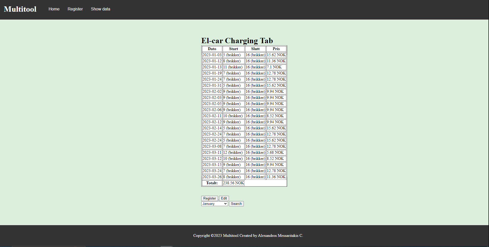

# Multitool

NOTES:
*This program is specifically programmed to calculate Citroen CZero model vehicle.*
You have to run the .php files locally. Use XAMPP and start both Apache local server and MySQL.
<h3>Home page</h3>

-------------------------------------------------------
<h3>Register page</h3>

-------------------------------------------------------
<h3>Fetches data from database of all the registered data</h3>

-------------------------------------------------------
<h3>Fetches specific data based on the date (In this case, February)</h3>

-------------------------------------------------------
<h3>Edit information either from the entire database or from a specific range of that data displayed</h3>

